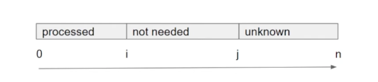
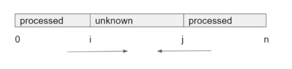

## Two pointers 正向

Process:

1. Initialize two pointers i and j, usually both equal to 0

2. Whild j < array.length:

- if we need array[j], then we keep it by assigning array[i] = array[j], and move i forward, make it ready at the next position.
- otherwise skip it. We do not need to move i since its spot is not fulfilled.

## Two pointers 反向

1. Initialize two pointers i = 0, j = array.length - 1
2. while i <= j:

- Decide what you should do based on the value of array[i] and array[j]
- Move at lease one pointer forward in its direction

<!-- more similar questions -->
1. Container With Most Water(11)
2. Trapping Rain Water(42)
3. Move Zeros(283)
4. Remove Duplicates From Sorted Array II(80)
5. Remove All Adjacent Duplicates In string(1047)
